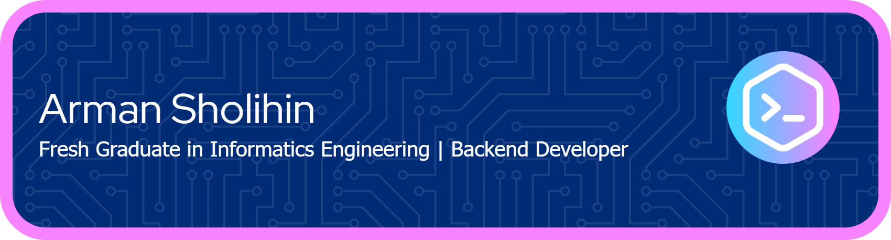

# 👋 Hello world, I'm Arman Sholihin
  

💻 Fresh Graduate in Informatics Engineering | Backend Developer | Laravel | API Development | Android Integration  
💬 I enjoy turning ideas into websites and Android app backends powered by Laravel APIs.   
🌱 Always learning, always coding.  

---

### 🛠️ Tech Stack & Tools

#### 🧩 Languages

#### ⚙️ Frameworks

#### 🗃️ Databases

#### 🧰 Tools

### ☁ Clouds

---

### 🚀 Featured Projects

#### 📱 [**Qolami 3.0**](https://github.com/ArmanSholihin/qolami-lughatech-be)  
> Android-based learning application for reading Hijaiyah letters.

- 🧩 **Role:** Backend Developer  
- 🛠️ **Tech Stack:** Kotlin, PHP, Laravel 11, PostgreSQL, Laragon  
- 🧾 **Description:** Developed the backend API system to manage multimedia-based learning modules (video, audio, image).  
- 🎓 *Undergraduate Thesis Project*

**⭐ Highlights:**  
- 🔧 Designed RESTful API compatible with Android using Laravel Sanctum.  
- 🎬 Implemented video/audio-based learning data management.  
- 📊 Optimized database schema for scalable learning modules.

**🔗 Links:**  
- 💻 [Backend Repository](https://github.com/ArmanSholihin/qolami-lughatech-be)  
- 📱 [Android App (Frontend Repo)](https://github.com/FadhilRabbani/Qolami3.0_LughahTech.git)  

---

#### 💸 [**Satu Niat**](https://github.com/MSIB-6-NCI/Project-Donasi-SIB6)  
> A donation website built during the MSIB 6 program.

- 🧩 **Role:** Fullstack Developer  
- 🛠️ **Tech Stack:** HTML, CSS, JavaScript, Laravel 11, PHP, MySQL, XAMPP  
- 🧾 **Description:** Developed a full donation management platform — covering authentication, data handling, and backend integration.

**⭐ Highlights:**  
- 🔐 Implemented secure login & registration with validation and role control.  
- 💳 Built a donation dashboard and payment simulation logic.  
- 🌐 Collaborated in a national internship program (**MSIB x Nurul Fikri Academy**).

**🔗 Links:**  
- 💻 [GitHub Repository](https://github.com/MSIB-6-NCI/Project-Donasi-SIB6)  
- 🧠 [MSIB Program Info](https://kampusmerdeka.kemdikbud.go.id/program/magang)  

---

#### 🧬 [**Viume**](https://github.com/ArmanSholihin/viumefinal)  
> AI-powered website for cervical cancer cell detection.

- 🧩 **Role:** Fullstack Web Developer  
- 🛠️ **Tech Stack:** HTML, CSS, JavaScript, Bootstrap, Python (Google Colab), MySQL  
- 🧾 **Description:** Integrated AI model predictions into a web system to analyze scanned cell images and detect abnormal patterns.

**⭐ Highlights:**  
- 🤖 Integrated trained AI model from Google Colab into the web backend.  
- 🧠 Handled file uploads, model response, and result visualization.  
- 💡 Designed intuitive UI for medical image interpretation assistance.

**🔗 Links:**  
- 💻 [GitHub Repository](https://github.com/ArmanSholihin/viumefinal)  

---

### 🧩 What I Do Best
- Backend Development with Laravel  
- RESTful API & JSON Data Integration  
- Database Design & Optimization (MySQL, PostgreSQL, JSON)  
- Fullstack Web Development (PHP, HTML, CSS, JS)  
- AI Integration with Web Apps (Python + Bootstrap)  

---

### 🌱 Currently Learning
- Advanced Laravel features (Queues, Events, API Resources)  
- Efficient PostgreSQL indexing & optimization  
- JSON schema design & hybrid database structures  
- AI deployment and backend integration  

---

### 📫 Let's Connect!
  
  

---

## 📊 Profile Statistics

  

---

### 💳 Github Profile Summary Card

---

<h3 align="center">⏱️ Streak Stats</h3>

---

### 📈 Activity Graph

 

<picture>
  <source media="(prefers-color-scheme: dark)" height="200" srcset="https://raw.githubusercontent.com/ArmanSholihin/ArmanSholihin/output/pacman-contribution-graph-dark.svg">
  <source media="(prefers-color-scheme: light)" srcset="https://raw.githubusercontent.com/ArmanSholihin/ArmanSholihin/output/pacman-contribution-graph.svg">
  
</picture>

---

### 📊 Most Used Language

---

### 🏆 Profile Trophies

---

